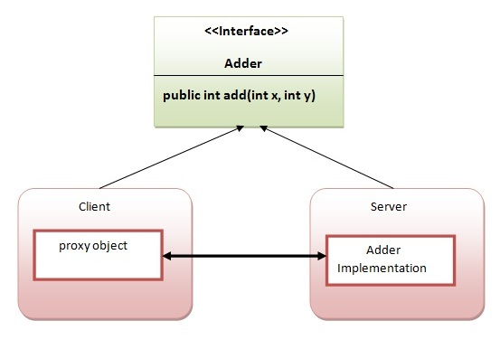

# Remote Method Invocation 

## What is RMI ?

- Remote Method Invocation (RMI) is a key technology in distributed systems, enabling the interaction between objects located on different machines.  

- The method invocation between the objects in different processes within a computer or 
different computer is known as remote method invocation.
 The method invocation between the objects in same process is known as local method 
invocation.

## Why RMI ?

Effective communication between distributed components is critical. RMI abstracts the complexity of network communication, allowing developers to focus on the application logic rather than the underlying communication details.

- As RMI provides a mechanism for invoking methods on objects located remotely, as if they were local,   
it simplifies communication between different processes running on separate JVMs (Java Virtual Machines) across a network i.e Inter-Process Communication.  

## RMI mechnaism 

RMI uses stub and skeleton object for communication with the remote object.

### Stub
The stub is an object which acts as a gateway for the **client side.** All the outgoing requests are routed through it. 
 It resides at the client side and represents the remote object.  
 When the caller invokes method on the stub object, it does the following tasks:

1. It initiates a connection with remote Virtual Machine (JVM),
2. It writes and transmits (marshals) the parameters to the remote Virtual Machine (JVM),
3. It waits for the result
4. It reads (unmarshals) the return value or exception, and
5. It finally, returns the value to the caller.

### Skeleton
The skeleton is an object, acts as a gateway for the **server side object.** All the incoming requests are routed through it. When the skeleton receives the incoming request, it does the following tasks:

1. It reads the parameter for the remote method
2. It invokes the method on the actual remote object, and
3. It writes and transmits (marshals) the result to the caller.

### Why RMI is known as Distributed Application/ Requirements for distributed Applications
If any application performs these tasks, it can be distributed application.

.
1. The application need to locate the remote method
2. It need to provide the communication with the remote objects, and
3. The application need to load the class definitions for the objects.
4. The RMI application have all these features, so it is called the distributed application.

### Code Implementation of JAVA RMI

The is given the 6 steps to write the RMI program.

1. Create the remote interface
2. Provide the implementation of the remote interface
3. Compile the implementation class and create the stub and skeleton objects using the rmic tool
4. Start the registry service by rmiregistry tool
5. Create and start the remote application
6. Create and start the client application

